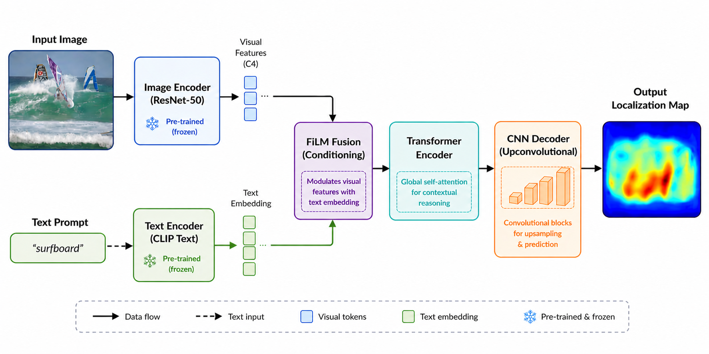

# adlcv_project



## Introduction (written by Marco)

Modern diffusion-based image editing systems can generate highly realistic im-
ages, yet they often struggle with deciding where objects should be placed in
a scene. Object occurrence define spatial priors: pizzas belong on tables, kites
appear in the sky, and boats occur on water. Learning these priors is essential
for controllable image editing, compositing, and scene understanding.
Recent work introduced a large-scale dataset of object placement annota-
tions generated using diffusion inpainting pipelines. The dataset contains ap-
proximately 27 million bounding box annotations across 27k scenes, where each
bounding box represents a candidate placement for an object class.
Many valid placements exist for a given object, and these placements form a
spatial distribution rather than a single target. The goal of these course projects
is to develop models that leverage and learns from this dense supervision and
predict spatial distributions of object placements

## POSTER

https://da.overleaf.com/1838933468npwsmqmhrsbv#103f63

## Project structure

The directory structure of the project looks like this:
```txt
├── .github/                  # Github actions and dependabot
│   ├── dependabot.yaml
│   └── workflows/
│       └── tests.yaml
├── configs/                  # Configuration files
├── data/                     # Data directory
│   ├── processed
│   └── raw
├── dockerfiles/              # Dockerfiles
│   ├── api.Dockerfile
│   └── train.Dockerfile
├── docs/                     # Documentation
│   ├── mkdocs.yml
│   └── source/
│       └── index.md
├── models/                   # Trained models
├── notebooks/                # Jupyter notebooks
├── reports/                  # Reports
│   └── figures/
├── src/                      # Source code
│   ├── project_name/
│   │   ├── __init__.py
│   │   ├── api.py
│   │   ├── data.py
│   │   ├── evaluate.py
│   │   ├── models.py
│   │   ├── train.py
│   │   └── visualize.py
└── tests/                    # Tests
│   ├── __init__.py
│   ├── test_api.py
│   ├── test_data.py
│   └── test_model.py
├── .gitignore
├── .pre-commit-config.yaml
├── LICENSE
├── pyproject.toml            # Python project file
├── README.md                 # Project README
└── tasks.py                  # Project tasks
```


Created using [mlops_template](https://github.com/SkafteNicki/mlops_template),
a [cookiecutter template](https://github.com/cookiecutter/cookiecutter) for getting
started with Machine Learning Operations (MLOps).


